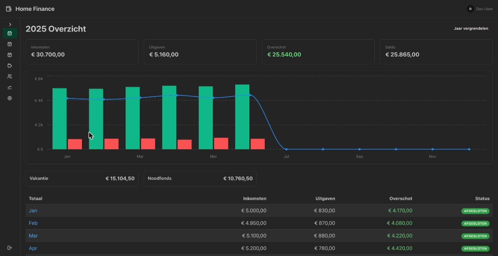
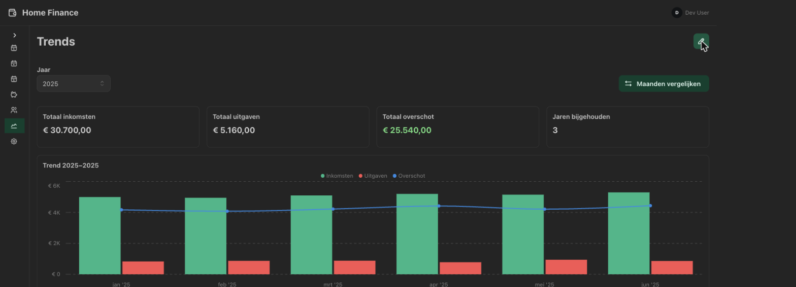
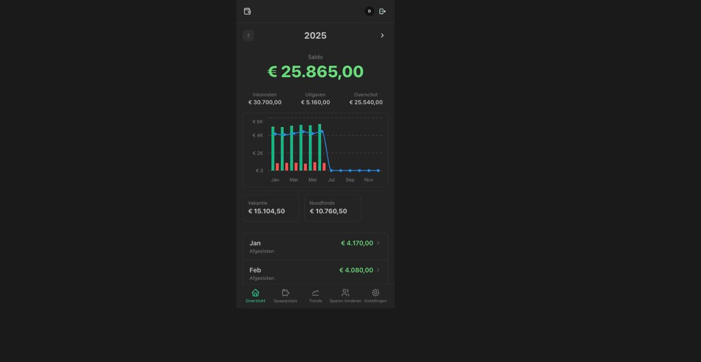

# Home Finance

A self-hosted family budget tracker: track monthly income and expenses, automatically allocate
savings into goal-based pots, and see where the money actually goes with a Trends dashboard.
Built to replace a fragile, manually-maintained Excel workflow.

<p align="center">
  
</p>
<p align="center">
  
  
</p>

## Features

- **Monthly budget tracking** — income and expenses per category, budget-vs-actual at a glance
- **Savings pots** — a ledger per pot with goals, and automatic percentage-based allocation of
  each month's surplus on close
- **Trends dashboard** — modular, customizable widgets (category breakdowns, multi-period
  comparisons, all-time trends) plus a dedicated month-vs-month drill-down
- **Excel export/import**, including a one-time migration path from a legacy spreadsheet
- **Role-based access** (admin/user) with a full audit log and step-up re-authentication on
  destructive actions
- **A real mobile app feel** below tablet width — a separate mobile IA (bottom tabs, list rows,
  bottom sheets), not a shrunk-down desktop layout
- **Kids' savings tracking**, separate from the main household ledger

Full history in [`CHANGELOG.md`](CHANGELOG.md) (auto-generated per release) — this list stays a
short summary on purpose.

## Stack

| Layer | Technology |
|---|---|
| Backend | Go, chi, pgx/v5, goose migrations |
| Frontend | React 19, Vite, Mantine v9, TanStack Query v5 |
| Database | PostgreSQL (CloudNativePG in prod) |
| Auth | OIDC/BFF — HttpOnly session cookie |
| Deploy | Kubernetes + Helm, GHCR image |

## Quick start (local dev)

**Prerequisites:** Docker, Go 1.26+ (`backend/go.mod`), Node 22+ (CI and the image build on 24)

```bash
cp .env.example .env
make dev          # starts postgres + dex, backend on :8080, frontend on :5173
```

Open http://localhost:5173 — dev login is via the local dex container
(`deploy/dex/config.yaml`: `wouter@example.com` / `password`). Set `DEV_FAKE_AUTH=true` to skip
OIDC entirely instead (only works with `ENV=development`).

```bash
make test                    # unit tests (backend + frontend)
make test-integration        # integration tests (needs running postgres)
make lint                    # go vet + golangci-lint + eslint
make build-image             # build docker image locally
```

## Running it for real

The intended deployment target is Kubernetes via the bundled Helm chart:

```bash
helm upgrade --install home-finance deploy/helm/home-finance \
  --set oidc.issuerURL=https://auth.example.com/application/o/home-finance/ \
  --set oidc.clientID=home-finance \
  --set ingress.host=finance.example.com \
  --set env.INITIAL_ADMIN_EMAILS=you@example.com \
  --set oidc.existingSecret=home-finance-oidc
```

You'll need an OIDC provider (Authentik, Keycloak, Authelia, anything standards-compliant) — this
app has no password-based login of its own by design. See **[docs/DEPLOYMENT.md](docs/DEPLOYMENT.md)**
for the full environment-variable reference, object-storage setup, database migrations, and the
release process.

## Documentation

- **[docs/DEPLOYMENT.md](docs/DEPLOYMENT.md)** — environment variables, Kubernetes/Helm, object storage, releasing
- **[docs/API.md](docs/API.md)** — full REST API reference
- **[AGENTS.md](AGENTS.md)** — conventions and architecture notes, for humans and AI coding agents alike
